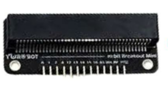
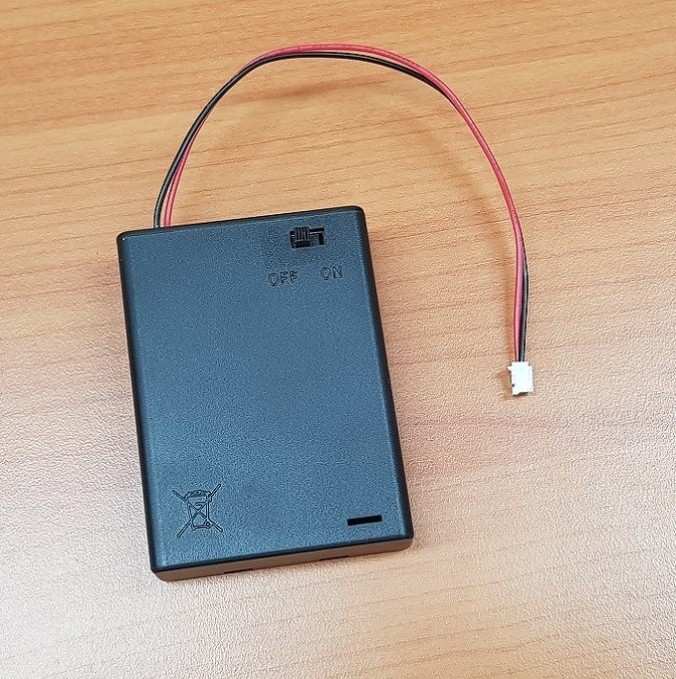

# 자벌레 만들기

## 얼마나 걸릴까요?
- 준비하기: 15분
- 만들기: 25-30분
- 프로그램 넣고 테스트하기: 15분
- 다 합치면: 약 1시간

## 필요한 것들
- 마이크로비트 확장보드 꺽임형  
  
- AA 배터리 2개  
- AA 배터리 케이스  
  
- 서보모터      
- 자벌레 종이      
- 가위    
- 글루건     
- 클립      
- 색연필이나 사인펜(선택사항)

## 자벌레 만들기

### 자벌레 종이 준비하기
1. 자벌레 종이를 준비해요.
2. 가위로 자벌레 모양을 오려내요.

   

### 서보모터와 자벌레 연결하기
1. 클립 펴서 서보모터 연장에 팔에 걸어요  
2. 서보모터 팔을 서보모터 기어에 장착해요
3. 자벌레 종이에 서보모터를 글루건으로 붙여요.
4. 자벌레 종이의 송곳구멍을 뚤고 클립을 종이에 연결합니다. 

### 확장보드에 마이크로비트 장착하기
1. 마이크로비트를 확장보드에 조심스럽게 꽂아요.
2. 확장보드와 마이크로비트의 연결 핀이 정확히 맞는지 확인해요.

## 안전에 주의하세요!

- 글루건을 사용할 때는 뜨거우니 선생님의 도움을 받으세요.
- 가위를 사용할 때 손가락을 다치지 않도록 조심하세요.
- 배터리를 넣을 때 (+)와 (-) 방향이 맞는지 확인하세요.